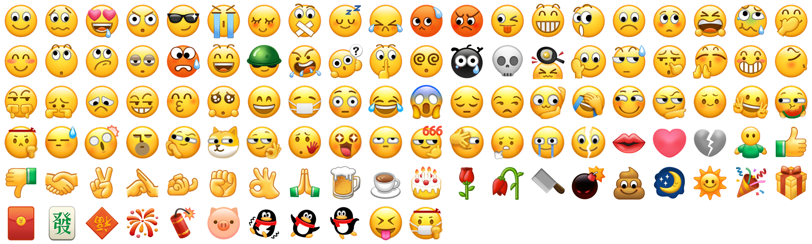

# 微信表情包 · WeChat Emoji Pack

微信官方原版默认表情素材包：**111 个高清表情 PNG（128×128，透明底）**，
顺序按微信默认表情面板人工对照排定（`001_微笑` … `111_加油加油`），
每个表情附带 **短代码**（`/微笑`、`[裂开]`）、**中文释义** 与 **Unicode 映射**。



## 内容

| 类别 | 数量 | 说明 |
| --- | --- | --- |
| 😀 经典表情 | 48 | 微笑、撇嘴、色、发呆、得意、流泪…囧、愉快、生病 |
| 😜 2021 新版表情 | 31 | 捂脸、奸笑、机智、吃瓜、旺柴、社会社会、裂开、苦涩、666、让我看看… |
| 🎁 符号/物件 | 32 | 玫瑰、红包、便便、啤酒、月亮、福、發、烟花、爆竹、蛋糕、强、弱… |

- 图片统一 `128×128`、透明底 PNG，直接可用于网页/客户端聊天界面。
- 文件名即顺序：`NNN_短代码.png`（`001_微笑.png` … `111_加油加油.png`）。
- `manifest.json` 为机器可读清单，字段说明：

| 字段 | 说明 | 示例 |
| --- | --- | --- |
| `order` | 面板顺序（1 起） | `1` |
| `file` | 图片文件名 | `001_微笑.png` |
| `name` | 微信短代码 | `/微笑`、`[裂开]` |
| `meaning` | 中文释义 | `微笑，礼貌、友好` |
| `type` | 类别：`wx-classic` / `wx-2021` / `wx-object` | `wx-classic` |
| `unicode` | 对应 emoji 字符（无则空） | `🙂` |
| `source` | 原图来源：`web` / `mp` | `web` |

## 使用方法

```html

```

前端把聊天文本里的微信短代码 / emoji 字符替换为表情图片（参考 `demo.html` 的 `renderRich`）：

```js
// 1. 短代码：/微笑、[裂开]
text.replace(/(\/[^\s，。！？,.!?]+|\[[^\]]+\])/g, (m) => {
  const rec = byCode.get(m.replace(/[\[\]\/]/g, ''));
  return rec ? `` : m;
});
// 2. emoji 字符：😂、🌹
text.replace(/[\u{1F000}-\u{1FAFF}\u{2600}-\u{27BF}]/gu, (ch) => {
  const rec = byUni.get(ch);
  return rec ? `` : ch;
});
```

`demo.html` 是一个开箱即用的仿微信聊天示例页（表情面板 + 释义 + 短代码转换），
浏览器直接打开即可预览效果。

## 目录结构

```
wechat-emoji/
├── assets/           # 111 个表情 PNG（128×128，按面板顺序命名）
├── manifest.json     # 机器可读清单（含短代码/释义/Unicode/来源）
├── manifest.csv      # 人读清单（Excel 可直接打开）
├── demo.html         # 仿微信聊天示例页（内嵌清单，离线可用）
└── preview-grid.png  # 全部表情拼图预览
```

## 数据来源与致谢

- 表情图片为腾讯微信官方渲染图，来自微信官方渠道：
  [Emojipedia 微信页](https://emojipedia.org/wechat/) · 微信公众平台（mp.weixin.qq.com）· Web 微信（web.wechat.com）
- 原图整理自社区仓库 [airinghost/wechat-emoji](https://github.com/airinghost/wechat-emoji)，
  本仓库在其基础上：**按微信默认面板顺序重排**、统一归一化到 128×128、
  补全中文释义与短代码/Unicode 映射。
- 排序经人工对照微信客户端默认表情面板逐项排定。

## 授权与免责声明 ⚠️

- 表情图片为**腾讯微信专有美术资产**，版权归腾讯所有；本仓库仅作**个人学习 / 非商用演示**用途整理发布。
- **禁止**用于任何商业用途；商用请改用开源套件（[OpenMoji](https://openmoji.org/) CC BY-SA、
  [Twemoji](https://github.com/twitter/twemoji) CC BY 4.0、[Noto Emoji](https://github.com/googlefonts/noto-emoji) Apache 2.0）。
- 本仓库的整理成果（manifest、README、示例代码）可自由使用；图片资源如需商用请联系腾讯获取授权。
- 若腾讯提出异议，本仓库将按 DMCA 流程下架相关资源。
